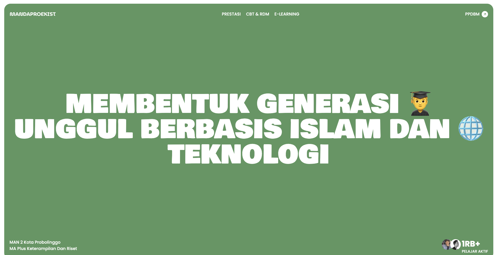

# MAN 2 Kota Probolinggo Website Revamp

## Modernizing the Face of Education

This repository holds the source code for the revamped website of MAN 2 Kota Probolinggo. The aim is to create a modern and engaging online presence that attracts prospective students and showcases the school's offerings.

## Key Features:

- **Fresh, Modern Design:** The website boasts a contemporary design that utilizes the school's colors, green and yellow, to create a vibrant and visually appealing atmosphere.

- **Targeted Content for Prospective Students:** The website prioritizes information relevant to prospective students, including enrollment details, academic programs, extracurricular activities, and school achievements.

- **Optimized for Enrollment Season:** The website's launch coincides with the new student enrollment period, maximizing its potential to capture the interest of prospective students.

- **Engaging User Experience:** Easy navigation and informative content ensure a smooth user experience for visitors exploring the website.